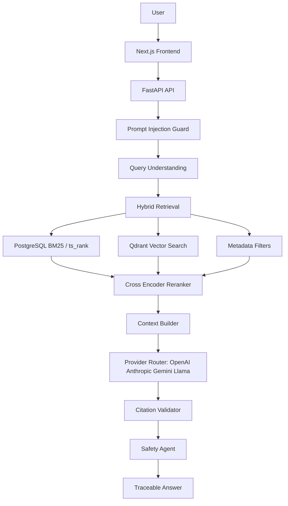

# NyayaGPT Architecture

## Multi-agent graph

Safety Agent → Retrieval Agent → Legal Research Agent → Case Law Agent → Final Answer Agent → Citation Verification Agent.

## Evidence invariant

The backend rejects responses when retrieval evidence is empty or when a citation does not map to an existing `(document_id, chunk_id, paragraph)` tuple.
