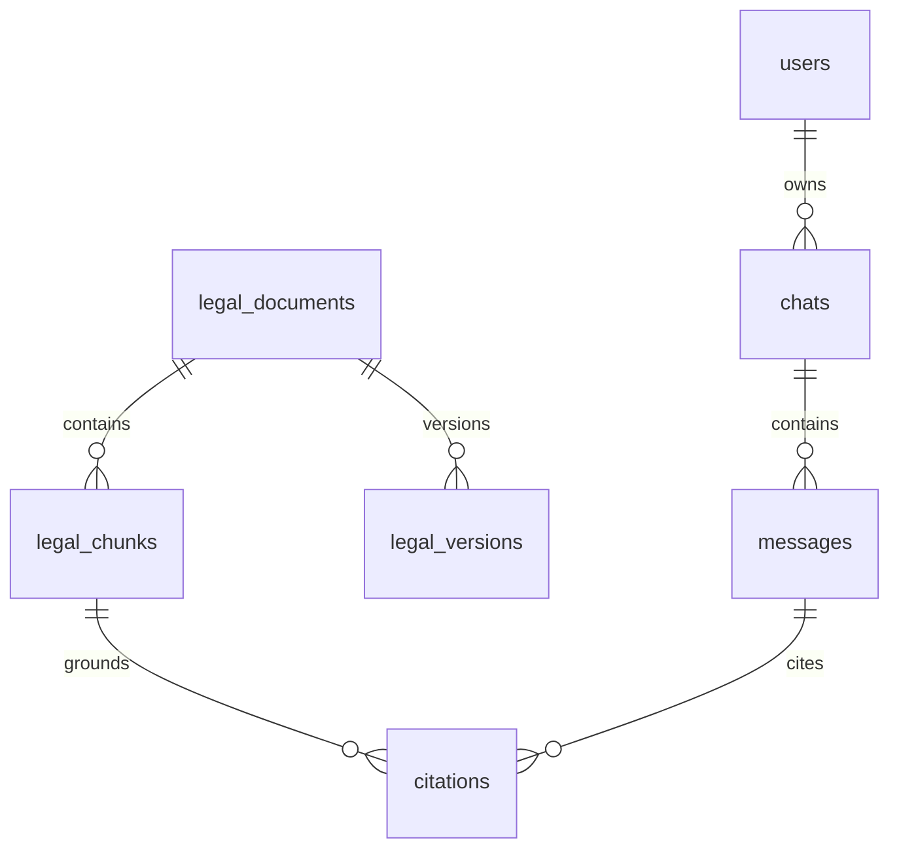

# Database Schema

## Core tables

- `legal_documents`: source type, title, act name, court, judges, citation, source URL, jurisdiction, versioning dates, repeal status.
- `legal_chunks`: document FK, parent chunk FK, section, paragraph, text, embedding reference, metadata JSONB.
- `legal_versions`: enactment date, amendment date, effective date, repeal status, supersedes FK.
- `retrieval_events`: query, retrieved chunk IDs, scores, rerank scores, latency, user/session IDs.
- `audit_logs`: authenticated principal, action, resource, IP, timestamp, tamper-evident hash.
